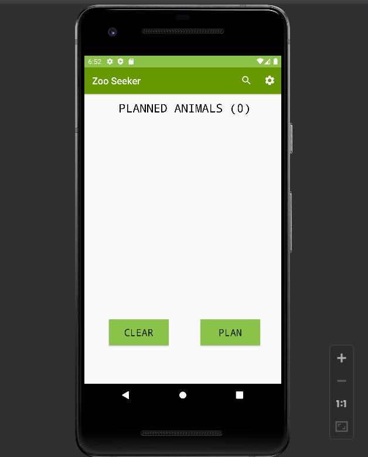
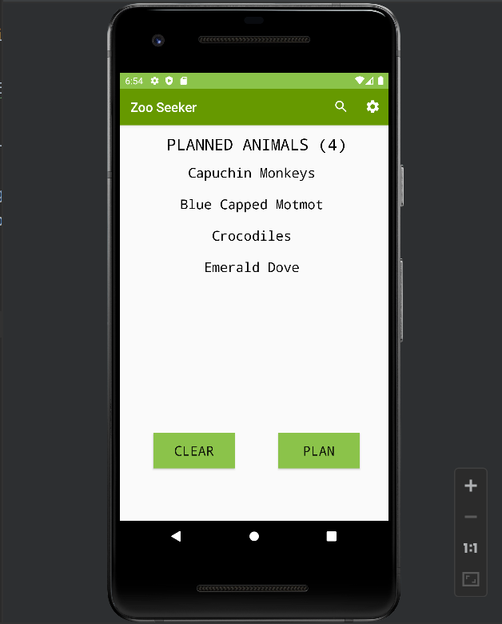
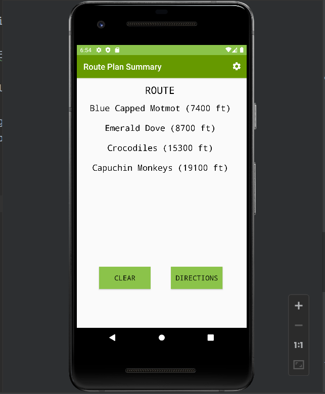
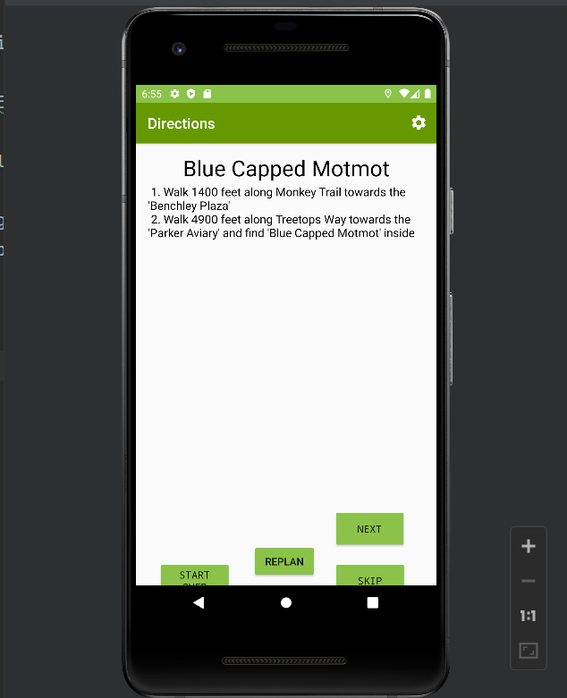
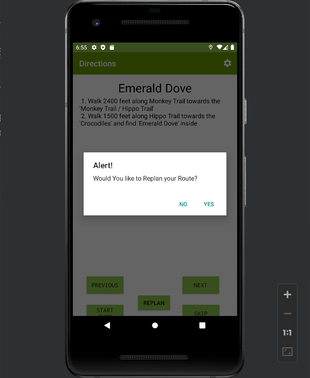

# PROJECT SUMMARY
## INTRODUCTION
With set of database including distance between exhibits, using Traveling Salesperson Problem (TSP) to find shortest route through the user's chosen exhibits.
...1. **Technologies:** Android
...2. **Tools:** Git, Github, Android Studio, Junit, Esprosso, Robolectric, Zenhub, Github Actions CI
...3. **Techniques:** 
......* Angile software process, Behavior-Driven Development (BDD)
......* Mobile software development
......* Unit testing, Object mocking, Continuous integration
......* Basic object-oriented design, Single responsibility principle, Dependency inversion, Open-closed principle
......* Design patterns: Strategy, Adapter, Observer, Model-View-Presenter

## DEMO

